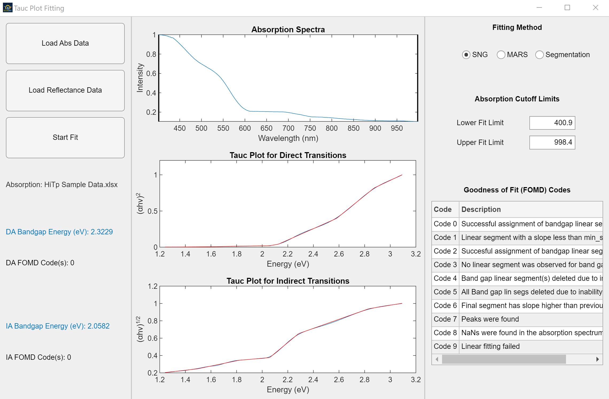
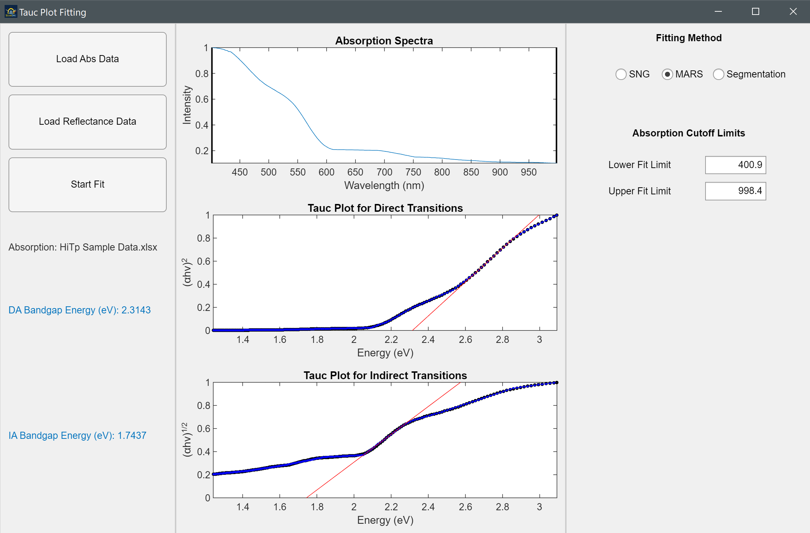
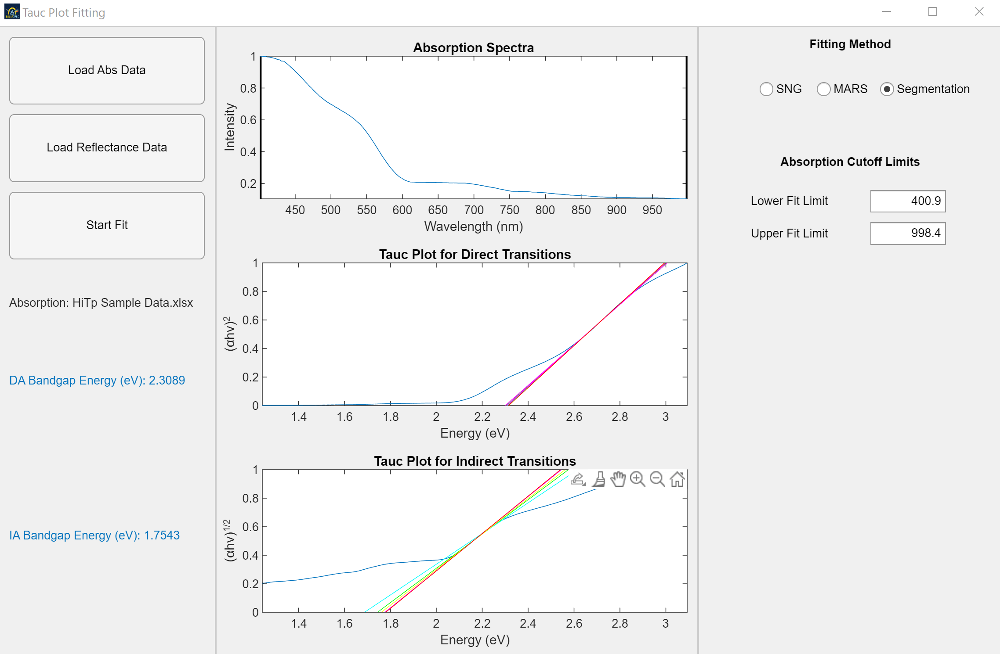

<div id="top"></div>

<!-- PROJECT SHIELDS -->
[![Contributors][contributors-shield]][contributors-url]
[![Forks][forks-shield]][forks-url]
[![Stargazers][stars-shield]][stars-url]
[![Issues][issues-shield]][issues-url]
[![MIT License][license-shield]][license-url]
[![LinkedIn][linkedin-shield]][linkedin-url]

<!-- PROJECT LOGO -->
<br />
<div align="center">
  <a href="https://github.com/SolarSpec/TaucPlotGUI">
    
  </a>

<h3 align="center">Tauc Plot GUI</h3>

  <p align="center">
    A Graphical User Interface for calculating band gap energies and visualizing Tauc plots for direct allowed and indirect allowed transitions
    <br />
    <a href="https://github.com/SolarSpec/TaucPlotGUI"><strong>Explore the docs »</strong></a>
    <br />
    <br />
    <a href="https://github.com/SolarSpec/TaucPlotGUI">View Demo</a>
    ·
    <a href="https://github.com/SolarSpec/TaucPlotGUI/issues">Report Bug</a>
    ·
    <a href="https://github.com/SolarSpec/TaucPlotGUI/issues">Request Feature</a>
  </p>
</div>

<!-- TABLE OF CONTENTS -->
<details>
  <summary>Table of Contents</summary>
  <ol>
    <li>
      <a href="#about-the-project">About The Project</a>
      <ul>
        <li><a href="#built-with">Built With</a></li>
      </ul>
    </li>
    <li>
      <a href="#getting-started">Getting Started</a>
      <ul>
        <li><a href="#prerequisites">Prerequisites</a></li>
        <li><a href="#installation">Installation</a></li>
      </ul>
    </li>
    <li><a href="#usage">Usage</a></li>
    <li><a href="#roadmap">Roadmap</a></li>
    <li><a href="#contributing">Contributing</a></li>
    <li><a href="#license">License</a></li>
    <li><a href="#contact">Contact</a></li>
    <li><a href="#acknowledgments">Acknowledgments</a></li>
  </ol>
</details>

<!-- ABOUT THE PROJECT -->
## About The Project

[![Tauc Screenshot][product-screenshot]](https://solarspec.ok.ubc.ca/)
An interactive GUI that allows for an input of absorption data to yield direct and indirect transition Tauc plots, giving subsequent band gap energies corresponding to the data.
There are three possible methods for calculating these band gap values which include: Santosh Newhouse Gregoire (SNG), Multivariate Adaptive Regression Spline
(MARS) and Segmentation methods.

<p align="right">(<a href="#top">back to top</a>)</p>

### Built With

* [MATLAB](https://www.mathworks.com/products/matlab.html)
* [Image Processing Toolbox](https://www.mathworks.com/help/images/)
* [Curve Fitting Toolbox](https://www.mathworks.com/help/curvefit/)

<p align="right">(<a href="#top">back to top</a>)</p>

<!-- GETTING STARTED -->
## Getting Started

To begin using this app is very simple. Just verify you have the necessary prequisites and follow the installation instructions.

### Prerequisites

Make sure MATLAB is installed. It is available for download in the Software Distribution section under the Help tab after you log into [Canvas.](https://canvas.ubc.ca/)
Click on the "Add-Ons" dropdown menu of your MATLAB Home screen. Then click on "Manage Add-Ons" and ensure you have the Image Processing Toolbox and the Signal Processing Toolbox. If not, click on the "Get Add-Ons" button instead and search for the aforementioned products.

### Installation

1. Clone the repo to your PC

   ```sh
   git clone https://github.com/SolarSpec/TaucPlotGUI.git
   ```

2. Now enter the repository and install the application in MATLAB

   ```
   Click on the .mlappinstall file in your repository
   ```

3. Browse the APPS header and click on the drop down.

   ```
   You will find the recently installed application under 'MY APPS' and can add it to your favourites
   ```

<p align="right">(<a href="#top">back to top</a>)</p>

<!-- USAGE EXAMPLES -->
## Usage

To begin, the user can load either absoprtion or reflectance data using the corresponding "Load Abs Data" and "Load Reflectance Data" buttons on the left panel. Initially, the app will populate the top "Absorption Spectra" plot with Intensity vs. Wavelength (nm) while overlaying ROI lines that allows the user to determine the fit limits of the data. If the data needs cropping to calculate proper Tauc plot ranges then the user can physically slide the ROI lines or update the limit fields on the right panel to achieve this. Furthermore, there are three possible fitting methods selectable at the top of this panel. These methods determine the fit and the resulting band gap values in various ways described below.

After the desired methods are chosen, the user can then begin determining the band gap values by clicking the "Start Fit" button. This will populate the remaining Direct and Indirect Transition Tauc plots in the middle panel; displaying either squared or rooted Absorption Coefficient*Energy respectively vs. Energy (eV). Once completed, the app will output the determined band gap values in the left panel in the order of [SNG MARS Segmentation]. If SNG is a selected method, it will output Goodness of Fit codes labelled "FOMD Codes" below the desired band gap values. These codes tell the user whether or not the fitting was successful and if not, what went wrong by comparing with the FOMD table on the right panel.

Finally, the user will now have the option to export the data by clicking the "Export Data" button on the right panel (unless the selected fitting methods are changed, in which the user will need to re-fit the data). Furthermore, the "Baseline Index" edit field will now be editable and it allows the user to select which linear segment of the baseline region will the line snap to, specifically only for the SNG and Segmentation methods.

<br />

### **Santosh Newhouse Gregoire Method (SNG)**

This method uses a baseline linear segment and the desired Tauc region linear segment to calculate the band gap energy at the crossing of these two lines. The abscissa is then used to determine the energy values in eV.
  
_Expert Scientist Guidelines for Band Gap Estimation:_ </br>
If multiple band gaps are observed, estimate band gap using the Tauc regions that explains higher proportion of Tauc property change.
In cases where a clear baseline is not observed but a trend for transition between the baseline and the absorption tail is observed, estimate band gap using best approximation of baseline.
Do not estimate a band gap when neither a clear baseline nor a trend for transition between the baseline and the absorption tail are observed.
Do not estimate band gap when only a lower limit of the band gap energy can be determined (due to the absorption transient extending beyond the high-energy limit of the spectrometer).

<div class="row" style="text-align:center">
  
</div>

</br>

### **Multivariate Adaptive Regression Spline Method (MARS)**

This method initially used the desired Tauc region linear segment with the axis crossing to calculate the band gap energy but has been updated to find the baseline segment and instead use the abscissa. These linear segments are determined by a weighting expression.

<div class="row" style="text-align:center">
  
</div>

</br>

### **Segmentation Method**

This method initially used the desired Tauc region linear segment with the axis crossing to calculate the band gap energy but has been updated to find the baseline segment and instead use the abscissa. This method draws multiple Tauc regions through linear regression and iterating various step sizes, then averages among them to find the best region.
  
<div class="row" style="text-align:center">
  
</div>

</br>

_For more information on these methods and algorithms, please refer to the paper [Automated algorithms for band gap analysis from optical absorption spectra](https://doi.org/10.1016/j.md.2018.04.003) by Marcus Schwarting, Sebastian Siola, Kevin Talley, Andriy Zakutayev, and Caleb Phillips_

<p align="right">(<a href="#top">back to top</a>)</p>

<!-- ROADMAP -->
## Roadmap

* [X] Plot Absorbtion or T-R vs. Wavelength
  * [X] Use ROI lines to cut data at specified wavelengths
* [X] Calculate subsequent DA and IA data
* [X] Plot and fit DA and IA Tauc plots
* [X] Calculate desired band gap energies
* [X] Use various methods to determine band gap energies
  * [X] View possible issues with fit through code table (SNG)

</br>

See the [open issues](https://github.com/SolarSpec/TaucPlotGUI/issues) for a full list of proposed features (and known issues).

<p align="right">(<a href="#top">back to top</a>)</p>

<!-- CONTRIBUTING -->
## Contributing

Contributions are what make the open source community such an amazing place to learn, inspire, and create. Any contributions you make are **greatly appreciated**.

If you have a suggestion that would make this better, please fork the repo and create a pull request. You can also simply open an issue with the tag "enhancement".
Don't forget to give the project a star! Thanks again!

1. Fork the Project
2. Create your Feature Branch (`git checkout -b feature/AmazingFeature`)
3. Commit your Changes (`git commit -m 'Add some AmazingFeature'`)
4. Push to the Branch (`git push origin feature/AmazingFeature`)
5. Open a Pull Request

<p align="right">(<a href="#top">back to top</a>)</p>

<!-- LICENSE -->
## License

All MATLAB code is distributed under the BSD 3-Clause License. See `LICENSE.txt` for more information. Please note that the MARS method used in both the MATLAB and accompanying Python files exhibits public works from NREL/HTEM that is under Copyright 2017 Alliance for Sustainable Energy, LLC. See `LICENSE.txt` in the NREL-HTEM directory for more information. Also view the `LICENSE.txt` in the file exchange directory for the public scripts used throughout the MARS and Segmentation methods.

<p align="right">(<a href="#top">back to top</a>)</p>

<!-- CONTACT -->
## Contact

SolarSpec - [SolarSpec Website](https://solarspec.ok.ubc.ca/) - vidihari@student.ubc.ca

Project Link: [https://github.com/SolarSpec/TaucPlotGUI](https://github.com/SolarSpec/TaucPlotGUI)

<p align="right">(<a href="#top">back to top</a>)</p>

<!-- ACKNOWLEDGMENTS -->
## Acknowledgments

* [Group Leader - Dr. Robert Godin](https://solarspec.ok.ubc.ca/people/)
* [Group Coder - Haris Vidimlic](https://solarspec.ok.ubc.ca/people/)
* [Santosh Suram](https://pubs.acs.org/doi/abs/10.1021/acscombsci.6b00053)
* [Marcus Schwarting](https://doi.org/10.1016/j.md.2018.04.003)
* [Caleb Phillips](https://doi.org/10.1016/j.md.2018.04.003)
* [The Entire SolarSpec Team](https://solarspec.ok.ubc.ca/people/)

<p align="right">(<a href="#top">back to top</a>)</p>

<!-- MARKDOWN LINKS & IMAGES -->
<!-- https://www.markdownguide.org/basic-syntax/#reference-style-links -->
[contributors-shield]: https://img.shields.io/github/contributors/SolarSpec/TaucPlotGUI.svg?style=for-the-badge
[contributors-url]: https://github.com/SolarSpec/TaucPlotGUI/graphs/contributors
[forks-shield]: https://img.shields.io/github/forks/SolarSpec/TaucPlotGUI.svg?style=for-the-badge
[forks-url]: https://github.com/SolarSpec/TaucPlotGUI/network/members
[stars-shield]: https://img.shields.io/github/stars/SolarSpec/TaucPlotGUI.svg?style=for-the-badge
[stars-url]: https://github.com/SolarSpec/TaucPlotGUI/stargazers
[issues-shield]: https://img.shields.io/github/issues/SolarSpec/TaucPlotGUI.svg?style=for-the-badge
[issues-url]: https://github.com/SolarSpec/TaucPlotGUI/issues
[license-shield]: https://img.shields.io/github/license/SolarSpec/TaucPlotGUI.svg?style=for-the-badge
[license-url]: https://github.com/SolarSpec/TaucPlotGUI/blob/main/LICENSE.txt
[linkedin-shield]: https://img.shields.io/badge/-LinkedIn-black.svg?style=for-the-badge&logo=linkedin&colorB=555
[linkedin-url]: https://linkedin.com/in/haris-vidimlic-06730019b/
[product-screenshot]: TaucPlotGUI_resources/Screenshot.png
